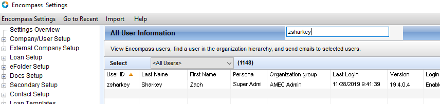
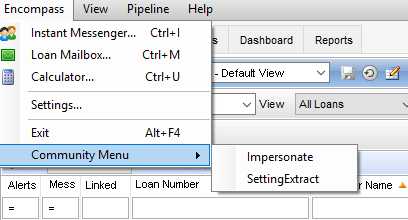
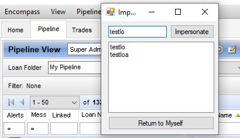
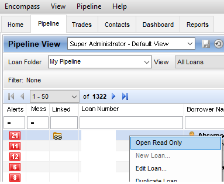
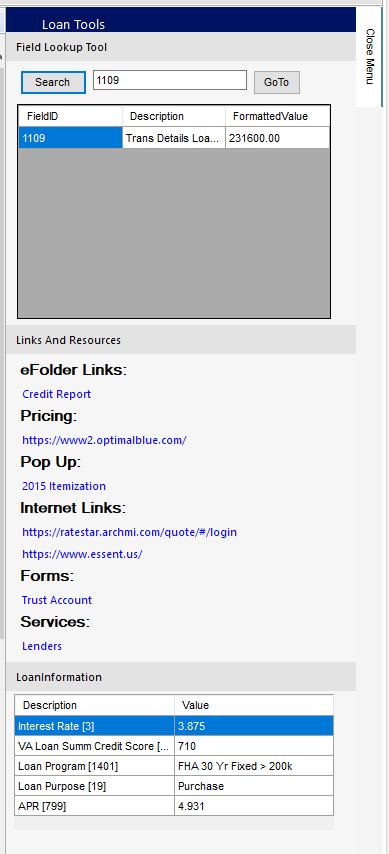
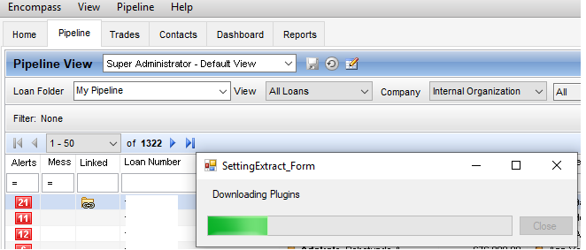

# CommunityPlugin

## Disclamer: This Plugin was created to use for free at your own risk. Always test this software in your test environment first.

**Dependencies:** Custom Field [CX.LOANOPEN], Custom Field [CX.OPENDOCUMENT] and Custom Data Object CommunitySettings.json

**Introduction:** This Plugin was created as a free way for the community to have a way to modify any part of encompass. This also includes a nice single plugin structure that you can use to further develop this custom to your specifications. Please create the two custom fields as well as uploading the Settings file in IFB. 

**Settings:** In the CommunitySettings File you will see a variety of properties you can change to suite your needs. Please at the very least update the TestServer to your test server that way you can leave the Permission->AllAccess property blank if you are just testing. Every Plugin will be listed below that you can add to the AllAccess section of Permission:
- AutomateInputFormSet
- BackAndForward
- FieldLookup
- GridSearch
- HCAutomate
- Impersonate
- KickEveryoneOut
- LinksAndResources
- LoanInformation
- OpeneFolderDocument
- OpenReadOnly
- SettingExtract
- SideMenu
- VirtualFields

New#
-Automate Emails
-Limit Services/Disable Services
-Open Input Form in Separate Window
-Lock Business Rules
-Alphabetize Alerts
-Saveable Pipeline Filters

## AutomateInputFormSet: 
This is an option to setup a folder inside your InputFormSets Base Folder as 'Persona'. Inside you can create a workflow to apply IFS when a loan opens. You can use all of these prefixes and they apply in this order: 
- User_{UserId}
- LoanType_{LoanTypeValue}_{Persona}
- Milestone_{MilestoneName}_{Persona}
- Persona_{Persona}
- Default

## BackAndForward: 
This is an option you will now see in the Forms/Tools/Services section to easily navigate between forms that have been opened already.

## GridSearch: 
This is an option you will now see in the Settings Menu to search any grid that pops up, self explanitory.

## HCAutomate: 
This is an option to Automate the closest 10 Home Counseling Providers triggerd by FR0108.

## Impersonate: 
This is an option you will see in the Community Top Menu to impersonate a user as a Super Admin.

## KickEveryoneOut: 
This is an option to created by Nikolai (EncompDev.com) to kick every non superadmin user out at 4AM and close Encompass.

## OpeneFolderDocument: 
This is an option to set custom field [CX.OPENDOCUMENT] to any placeholder in the efolder documents and the document will open.

## OpenReadOnly: 
This is an option you will now see in the Pipeline Context (right click) menu to Open any Loan Read only.

## SideMenu: 
This is an option to give users a static menu that is always open inside a loan. Everything in this plugin was created to easily expand
upon.

-  FieldLookup: 
This is a Tool inside the Loan Menu to lookup a field by id, description or value.

-  LoanInformation: 
This is a Tool inside the Loan Menu that you can customize inside of CommunitySettings.json to let different personas see specific fields all the time in a loan file.

- LinksAndResources: 
This is a Tool you can customize inside of CommunitySettings.json to let users click links, open eFolder Documents, etc.

## SettingExtract: 
This is an option you will see in the Community Top Menu to extract all settings to a zip file.

## VirtualFields: 
To be Described.

## License
[MIT](https://choosealicense.com/licenses/mit/)
